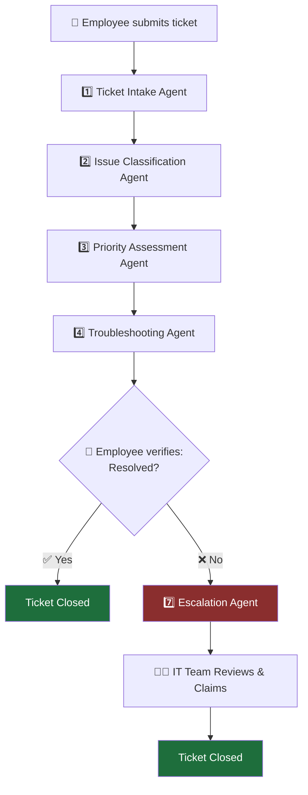
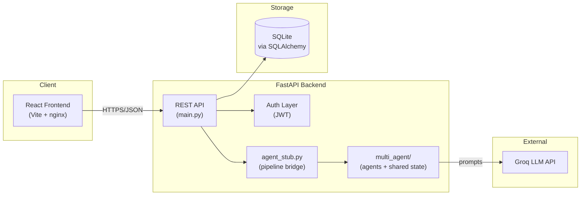
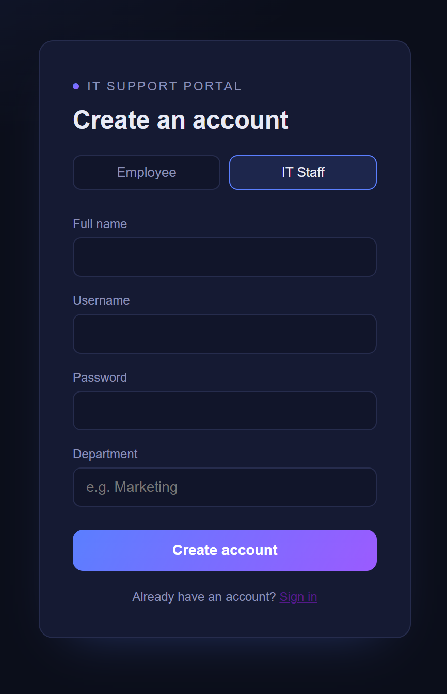
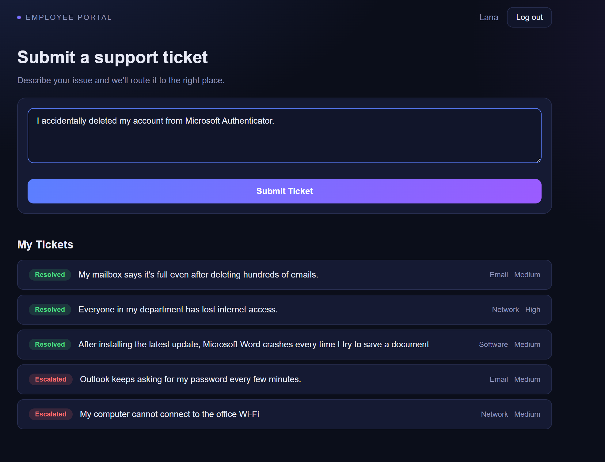
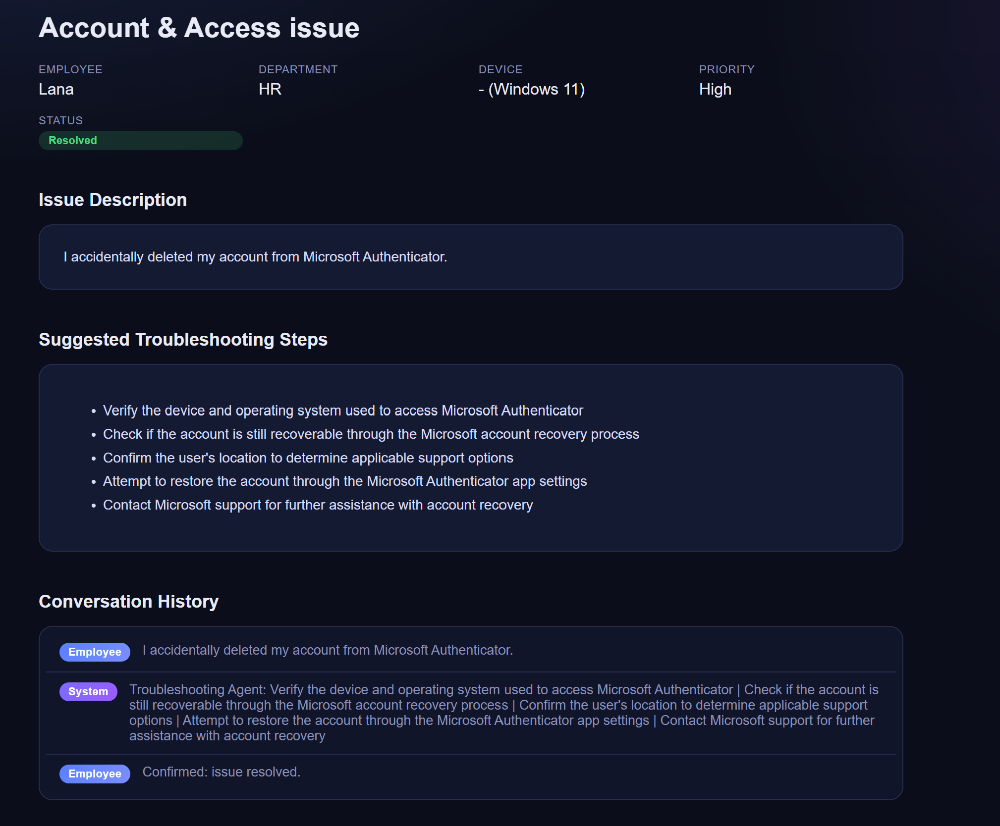
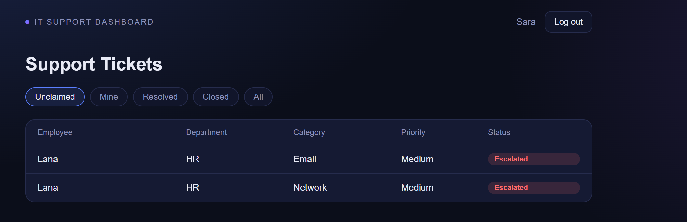

# 🎫 Enterprise IT Support Capstone
 
### AI-Powered Multi-Agent IT Support System
 
An intelligent IT support platform where a team of collaborating AI agents triages, classifies, prioritizes, troubleshoots, and escalates employee IT tickets — backed by a production-style FastAPI service, SQLite persistence, JWT authentication, and a React frontend, fully containerized with Docker.
 
[](https://www.python.org/)
[](https://fastapi.tiangolo.com/)
[](https://www.langchain.com/langgraph)
[](https://www.docker.com/)
[](https://react.dev/)
[](https://docs.pydantic.dev/)
 
</div>
---
 
## 📖 Overview
 
Enterprise IT Support Capstone reimagines the traditional IT helpdesk as a **multi-agent pipeline**. Instead of a single chatbot or a static form, every ticket flows through a chain of specialized AI agents — each responsible for one clearly scoped task — coordinated through a shared state object in a LangGraph-compatible design. A human employee stays in the loop at the one point that matters most: confirming whether their issue is actually resolved.
 
The result is a system that behaves like a real enterprise support desk: it extracts what it needs from a plain-English description, classifies and prioritizes automatically, suggests troubleshooting steps immediately, and only escalates to a human IT team when automation genuinely can't close the loop.
 
---
 
## ✨ Features
 
- 🤖 **Six collaborating AI agents** sharing one state object, each with a single responsibility
- 🔐 **JWT-based authentication** with role separation between `employee` and `it` accounts
- 🗃️ **Persistent ticket lifecycle** (SQLite + SQLAlchemy) — from creation through resolution or escalation
- 🧠 **LLM-backed reasoning** for classification, prioritization, and troubleshooting, with **strict Pydantic validation** and safe fallbacks if a response can't be parsed
- 👤 **Human-in-the-loop verification** — resolution is confirmed by the employee, not inferred by the model
- 📋 **Full audit trail** via a running `conversation_history` on every ticket
- 🐳 **One-command startup** with Docker Compose (backend + frontend together)
- 📑 **Auto-generated API docs** via FastAPI's built-in Swagger UI
---
 
## 🏗️ System Architecture
 
### Agent Pipeline
 

 
### Application Architecture
 

 
---
 
## 🤖 AI Agents
 
Every agent is a plain function `(state: SharedState) -> dict`, so it can be dropped directly into a LangGraph `StateGraph`. Each agent reads what it needs from the shared state and returns only the keys it's responsible for.
 
<details>
<summary><strong>1️⃣ Ticket Intake Agent</strong> — structures the raw ticket</summary>
<br>
Receives the employee's free-text issue description and extracts structured fields: `issue_summary`, `affected_system`, `device`, `operating_system`, `error_message`, and `location`. Flags any information that's missing but relevant, and generates follow-up questions **only** when genuinely necessary.
 
`department` is deliberately **not** extracted here — the employee is already authenticated, so their department comes from the internal user profile, not from parsing their message.
 
</details>
<details>
<summary><strong>2️⃣ Issue Classification Agent</strong> — categorizes the ticket</summary>
<br>
Classifies the ticket into exactly one of eight categories, using the structured output from Ticket Intake rather than the raw text:
 
`Email` · `Network` · `Hardware` · `Software` · `Account & Access` · `Security` · `Printer` · `VPN`
 
Returns a `confidence` score and a short `reason` alongside the category.
 
</details>
<details>
<summary><strong>3️⃣ Priority Assessment Agent</strong> — determines urgency</summary>
<br>
Assigns one of four priority levels — `Low`, `Medium`, `High`, `Critical` — weighing business impact, number of affected users, security implications, whether a core service is down, and the urgency implied by the employee.
 
</details>
<details>
<summary><strong>4️⃣ Troubleshooting Agent</strong> — generates actionable steps</summary>
<br>
Produces 2–6 ordered, safe troubleshooting steps based on the ticket's classification and priority — the safest, least disruptive checks first. Never claims an action has already been taken, never suggests destructive actions, and falls back to a safe generic checklist if the LLM response can't be validated.
 
</details>
<details>
<summary><strong>6️⃣ Verification Agent</strong> — confirms resolution (human-in-the-loop)</summary>
<br>
Intentionally **not** an LLM call. Resolution is decided by the employee via two buttons in the UI (Resolved / Not Resolved), and this agent's only job is to normalize that human decision into the shared state so the pipeline can branch correctly. Defaults to "not resolved" if no input is present, so a ticket never silently disappears.
 
</details>
<details>
<summary><strong>7️⃣ Escalation Agent</strong> — hands off to the IT team</summary>
<br>
Runs only when the employee reports the issue is still unresolved. Writes a concise, professional summary for the IT team covering the issue, category, priority, troubleshooting steps already attempted, and the full conversation history — with a plain-text fallback summary if the LLM response fails to parse, so an escalation never gets silently dropped.
 
</details>
<details>
<summary><strong>ℹ️ A note on Agent 5 (Action Agent)</strong></summary>
<br>
The original design included a simulated Action Agent (auto-resetting passwords, unlocking accounts, etc.). In the current implementation, the pipeline intentionally goes straight from Troubleshooting (4) to human Verification (6): the employee follows the suggested steps directly rather than the system performing simulated actions on their behalf. Re-introducing a scoped Action Agent is tracked under [Future Improvements](#-future-improvements).
 
</details>
---
 
## 🛠️ Technology Stack
 
| Layer | Technology |
|---|---|
| **Agent Orchestration** | LangGraph-compatible agent functions, LangChain patterns |
| **LLM Provider** | Groq (via OpenAI-compatible API) |
| **Backend Framework** | FastAPI |
| **Data Validation** | Pydantic |
| **Database / ORM** | SQLite + SQLAlchemy |
| **Authentication** | JWT (`python-jose`) + `passlib` (bcrypt) |
| **Frontend** | React + Vite |
| **Web Server (Frontend)** | nginx |
| **Containerization** | Docker, Docker Compose |
| **Language** | Python 3.11+ |
 
---
 
## 📁 Project Structure
 
```
Enterprise-IT-Support-CapstoneProject/
├── backend/
│   ├── multi_agent/
│   │   ├── agents/
│   │   │   ├── ticket_intake.py          # Agent 1
│   │   │   ├── issue_classification.py   # Agent 2
│   │   │   ├── priority_assessment.py    # Agent 3
│   │   │   ├── troubleshooting.py        # Agent 4
│   │   │   ├── verification.py           # Agent 6
│   │   │   └── escalation.py             # Agent 7
│   │   ├── agent_state.py                # Shared SharedState + constants
│   │   └── graph.py                      # LangGraph StateGraph wiring
│   ├── llm_client.py                     # Shared Groq client, call_llm(), extract_json()
│   ├── agent_stub.py                     # Bridges FastAPI <-> the agent pipeline
│   ├── auth.py                           # JWT auth, password hashing, role guards
│   ├── database.py                       # SQLAlchemy engine/session setup
│   ├── models.py                         # ORM models + Pydantic schemas
│   ├── main.py                           # FastAPI app & routes
│   ├── requirements.txt
│   └── Dockerfile
├── frontend/
│   ├── src/
│   ├── index.html
│   ├── nginx.conf
│   ├── package.json
│   ├── vite.config.js
│   └── Dockerfile
├── docker-compose.yml
├── .env.example
├── .gitignore
└── README.md
```
 
---
 
## 🚀 Installation
 
```bash
# Clone the repository
git clone https://github.com/LanaAljuaid/Enterprise-IT-Support-CapstoneProject.git
cd Enterprise-IT-Support-CapstoneProject
```
 
---
 
## 🔑 Environment Variables
 
Copy the example file and fill in your own values:
 
```bash
cp .env
```
 
**`.env`:**
 
```env
# Groq API key used by every LLM-backed agent
GROQ_API_KEY=your-groq-key-here
 
```
 
---
 
## 🐳 Running with Docker
 
The fastest way to get the full stack (backend + frontend) running:
 
```bash
docker compose up --build
```
 
This builds and starts both services using their respective `Dockerfile`s. Check `docker-compose.yml` for the exact port mappings configured in your environment — by default, expect the FastAPI backend on **`http://localhost:8000`** and the frontend on the port defined under its service in that file.
 
To stop everything:
 
```bash
docker compose down
```
 
---
 
## 📑 API Documentation
 
Once the backend is running, FastAPI's interactive Swagger UI is available at:
 
```
http://localhost:8000/docs
```
 
<details>
<summary><strong>Key Endpoints</strong></summary>
<br>
| Method | Endpoint | Description |
|---|---|---|
| `POST` | `/auth/signup` | Register a new employee or IT staff account |
| `POST` | `/auth/login` | Log in and receive a JWT access token |
| `GET` | `/auth/me` | Get the currently authenticated user's profile |
| `POST` | `/tickets` | Submit a new ticket — runs Agents 1 → 4 automatically |
| `POST` | `/tickets/{id}/verify` | Submit Resolved / Not Resolved — runs Agent 6 (+ 7 if unresolved) |
| `GET` | `/tickets/mine` | List the authenticated employee's own tickets |
| `GET` | `/tickets` | (IT role) List tickets, filterable by `view=unclaimed\|mine\|resolved\|closed\|all` |
| `PATCH` | `/tickets/{id}/claim` | (IT role) Claim an escalated ticket |
| `PATCH` | `/tickets/{id}/close` | (IT role) Close a ticket |
| `GET` | `/tickets/{id}` | Get a single ticket's full detail |
| `GET` | `/health` | Health check |
 
</details>
---
 
## 🔄 Example Workflow
 
1. **Submission** — An employee logs in and submits: *"I can't send or receive emails on Outlook, getting a 'Cannot connect to server' error."*
2. **`POST /tickets`** triggers the pipeline:
   - **Ticket Intake Agent** extracts the issue summary, affected system (`Email`), error message, and device/OS (falling back to the employee's stored profile if not mentioned in the text).
   - **Issue Classification Agent** categorizes it as `Email` with a confidence score and reason.
   - **Priority Assessment Agent** rates it `High`, citing the business impact of email downtime.
   - **Troubleshooting Agent** generates safe first steps: *"Restart Outlook," "Verify internet connectivity," "Clear the Outlook cache."*
3. The ticket is saved with status `awaiting_verification`, and the employee sees the troubleshooting steps immediately.
4. **Employee follows the steps**, then responds via two buttons: **Resolved** or **Not Resolved**.
5. **`POST /tickets/{id}/verify`**:
   - If **Resolved** → status becomes `resolved`, ticket is closed from the employee's side.
   - If **Not Resolved** → **Verification Agent** logs the outcome, then the **Escalation Agent** compiles a full summary (issue, category, priority, steps attempted, conversation history) and the ticket's status becomes `escalated`.
6. **IT staff** see the escalated ticket in their queue, **claim** it, work the issue using the full context provided, and **close** it once resolved.
---
 
## 🖼️ Screenshots
 
## Screenshots

### Login


### Submit Ticket


### Troubleshooting


### IT Support Dashboard


</div>
---
 
## 🔮 Future Improvements
 
- 🧭 **Action Agent** — scoped, simulated automated actions (password reset, account unlock, service restart) between Troubleshooting and Verification
- 📚 **Knowledge Base Agent** — retrieval-augmented answers grounded in internal IT documentation
- 🛠️ **Resolution Agent** — deeper root-cause analysis for issues that repeatedly escalate
- 🧠 **Persistent memory** across an employee's tickets, to spot recurring issues automatically
- 🔒 **Expanded security layer** — rate limiting, refresh tokens, audit logging
- 📊 **Analytics dashboard** — ticket volume, resolution time, and category trends for IT leadership
- 🧪 **Automated test suite** for every agent and API endpoint
---
 

 
## 👤 Authors
 
**Lana Aljuaid**
[GitHub](https://github.com/lanaAljuaid) · [LinkedIn](https://linkedin.com/in/lana-aljuaid-cs)

 **Dana**
[GitHub](https://github.com/your-username) · [LinkedIn](https://linkedin.com/in/your-profile)
</div>

